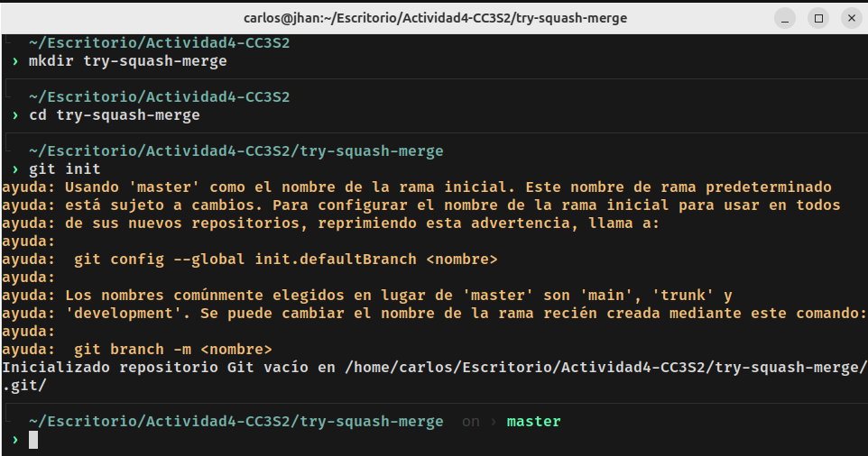
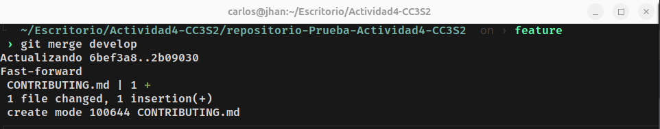

# Actividad: Explorando diferentes formas de fusionar en Git - Parte 1

### Objetivo: En esta actividad, exploraremos el proceso de fusionar dos ramas en Git utilizando tres métodos diferentes: fast-forward, no-fast-forward, y squash. A travéz de los ejemplos, comprenderás, cómo fusionar y cuándo es recomendado utlizar cada tipo de fusión.


1. Fusión Fast-forward (git merge --ff)

La fusion fast-forward es la forma más simple de combinar ramas en Git. Solo es posible cuando la rama base no ha recibido nuevos commits desde que se creó la rama feature.

##### Pasos prácticos:

* Crear un nuevo repositorio

```shell
    $ mkdir try-fast-forward-merge
    $ cd try-fast-forward-merge
    $ git init
```

Prueba:
Se creara un nuevo directorio donde trajaremos la fusión de ramas por medio de fast-forward, accederemos a este directorio creado y inicializaremos git.


* Agregar un arhcivo inicial en la rama principal (main)

```shell
    $ echo "# Mi Proyecto" > README.md
    $ git add README.md
    $ git commit -m "Commit inicial en main"
```

Prueba:
Una vez inicializado git crearemos un archivo llamado README.md el cual llevara por titulo 'Mi Proyecto', luego agregaremos este archivo al area de preparación (staging), seguido de git commit para guardar los cambios que están en el área de preparación con el commit de "Commit inicial en main".

* Crear y cambiar a una nueva rama 'add-description'

```shell
    $ git checkout -b add-description
```

Prueba:
Crearemos la rama 'add-description' y nos cambiaremos de posición a está nueva rama para continuar con el desarrollo de la actividad.


* Hacer cambios en la nueva rama y comitearlos

```shell
    $ echo "Este proyecto es un ejemplo de cómo usar Git.">>README.md
    $ git add README.md
    $ git commit -m "Agregar descripción al README.md"
```

Prueba:
En la nueva rama add-description modificaremos el archivo README.md con el mensaje "Este proyecto es un ejemplo de cómo usar Git.", seguidamente prepararemos los cambios en el stage y luego guardaremos los cambios que esten en el stage con el commit "Agregar descripción al README.md".


* Cambiar de vuelta a la rama 'main' y realizar la fusión fast-forward

```shell
    $ git checkout main
    $ git merge add-description
```

Prueba:
Cambiaremos a la rama main para poder fusionar la rama main con la rama add-description con el proposito de integrar los cambios realizados en el archivo README.md de la rama add-description.
Al observar el historial de commit con el comando git log --graph --oneline --all verificamos que la fusion de ramas fue exitosa.


2. Fusión No-fast-forward (git merge --no-ff)

La fusión no-fast-forward crea un nuevo commit de fusión. Es útil para preservar el contexto de la fusión, especialmente en equipos donde se requiere más claridad en el historial de cambios.


##### Pasos prácticos:

* Crear un nuevo repositorio

```shell
    $ mkdir try-no-fast-forward-merge
    $ cd try-no-fast-forward-merge
    $ git init
```

Prueba:
Se creara un nuevo directorio donde trajaremos la fusión de ramas por medio de no-fast-forward, accederemos a este directorio creado y inicializaremos git.


* Agregar un archivo inicial en la rama pricipal (main)

```shell
    $ echo "# Mi Proyecto">README.md
    $ git add README.md
    $ git commit -m "Commit inicial en main"
```

Prueba:
En la rama principal main crearemos el archivo README.md con el mensaje o titulo "Mi Proyecto", luego prepararemos los cambios en el stage con git add README.md para luego guardar los cambios que esten en el stage con git commit con el commit "Commit inicial en main".


* Crear y cambiar a una nueva rama 'add-feature'

```shell
    $ git checkout -b add-feature
```

Prueba:
Crearemos la rama add-feature y luego nos posicionaremos sobre esta rama para continuar con el desarrollo de la actividada.


* Hacer cambios en la nueva rama y comitearlos

```shell
    $ echo "Implementando una nueva caracteristica...">>README.md
    $ git add README.md
    $ git commit -m "Implementar nueva caracteristica"
```

Prueba:
Modificaremos el archivo README.md en la rama add-feature, luego prepararemos estos cambios en el stage con el comando git add README.md seguidamente guardaremos los cambios que estén en el stage con el comando git commit con el commit "Implementar nueva caracteristica".


* Cambiar de vuelta a la rama 'main' y realizar una fusión de-fast-forward

```shell
    $ git checkout main
    $ git merge --no-ff add-feature
```

Prueba:
Nos ubicaremos en la rama 'main' para realizar la fusión no-fast-forward con la rama 'add-feature'.
Al usar el comando 'git merge --no-ff add-feature' para la fusión de las ramas nos pedira crear un commit el cual especificaremos el motivo de esta fusión, seguidamente visualizaremos el historial de commit en donde podremos observar que la fusion no-fast-forward se realizo con exito.


3. Fusión squash (git merge --squash)

La fusión squash combina todos los cambios de una rama en un solo commit en la rama principal. Este método es util cuando se requiere mantener un historial de commits limpio.


##### Pasos prácticos:

* Crear un nuevo repositorio

```shell
    $ mkdir try-squash-merge
    $ cd try-squash-merge
    $ git init
```

Prueba:
Se creara un nuevo directorio donde trajaremos la fusión de ramas por medio de try-squash-merge, accederemos a este directorio creado y inicializaremos git.



* Agregar un archivo inicial en la rama principal (main)

```shell
    $ echo "# Mi Proyecto">README.md
    $ git add README.md
    $ git commit -m "Commit inicial en main"
```

Prueba:
En la rama 'main' craremos el archivo README.md con el mensaje o titulo "Mi Proyecto", luego prepararemos los cambios realizados en el area de stage para luego guardarlos los cambios que se encuentran en el area de stage con el comando git commit con el commit "Commit inicial en main".


* Crear y cambiar a una nueva rama 'add-basic-files'

```shell
    $ git checkout -b add-basic-files
```

Prueba:
Creación y eleción de la rama 'add-basic-files'


* Hacer algunos cambios y comitearlos

```shell
    $ echo "# CÓMO CONTRIBUIR">>CONTRIBUTING.md
    $ git add CONTRIBUTING.md
    $ git commit -m "Agregar CONTRIBUTING.md"
    $ echo "# LICENCIA">>LICENSE.txt
    $ git add LICENSE.txt
    $ git commit -m "Agregar LICENSE.txt"
```

Prueba:
En la nueva rama 'add-basic-files' crearemos el archivo CONTRIBUTING.md con el mensaje "CÓMO CONTRIBUIR", luego prepararemos esta modificación en el area de stage para posteriormente guardar estos cambios del area de stage con el commit git commit con el commit "Agregar CONTRIBUTING.md", también crearemos el archivo LICENSE.txt con el mensaje "LICENCIA", prepararemos esta modificacion en el area de stage para posteriormente guardar estos cambios del area de stage con el comando git commit con el commit "Agregar LICENSE".
Visualización de historial de commit con el camando 'git log --graph --oneline --all'


* Cambiar de vuelta a la rama 'main' y realizar la fusión squash

```shell
    $ git checkout main
    $ git merge --squash add-basic-files
```

Prueba:
Nos ubicaremos en la rama 'main' y realizaremos una fusión squash de la rama 'main' con la rama 'add-basic-files'. Para completar la fusión squash tendremos que realizar un commit adicional, este commit es "Agregar documentacion estandar de repositorio".
Visualización del historial de commits con el comando "git log --graph --oneline --all".


#### Ejercicios

##### Clona un repositorio Git con multiples ramas.
Clonación de un repositorio de git el cual contiene 3 ramas:

Prueba:


* Identifica dos ramas que puedas fusionar utlizando git merge --ff.

Prueba:
En la siguiente imagen podemos visualizar que las ramas 'develop' y 'feature' podrian hacer una fusión try-fast-forward, esto se debe a que la rama 'feature' no tiene los cambios realizados en la rama 'develop'. No se agregarón más cambios a la rama 'feature' pero si se agregarón más cambios a la rama 'develop', debido a esto la fusión try-fast-forward si pudo ser posible.


* Haz el proceso de fusión utlizando git merge --ff.

Prueba:
Se realizo la fusión de la rama 'feaure' con la rama 'develop' sin problemas.



* Verifica el historial con git log --graph --oneline.

Prueba:
Se puede observar la correcta fusion try-fast-forward de las ramas 'feature' y 'develop'.


##### Pregunta:

¿En qué situaciones recomiendas evitar el uso de git merge --ff? Reflexiona sobre las desventajas deeste metodo.

No es recomendable usarlo cuando se quiere mantener un historial claro de las ramas que se pretenden fusionar o al trabajar en ramas que son de un proposito especifico para el desarrollo de software como por ejemplo en el caso de ramas como develop y release, que tiene fines espeficicos en el desarrollo de software.

##### Simula un flujo de trabajo de equipo

* Trabaja en dos ramas independientes, creando diferentes cambios en cada una.

Prueba:
Se creo el directorio 'simulacion' y inicializamos git con el objetivo de simular un trabajo en equipo al usar diferentes ramas (main y feature) haciendo modificaciones al archivo README.md creado inicialmente en la rama 'main'.


* Fusiona ambas ramas con git merge --no-f para ver cómo se crean los commits de fusión.

Prueba:
Uso de la fusión no-fast-forward en las ramas 'main' y 'feature', la fusión no tiene inconvenientes.


Al usar la fusion no-fast-forward nos pide generar un nuevo commit de fusión, esto se hace con el proposito de especificar cual fue el motivo de la fusión.

Prueba:


* Observar el historial utilizando git log --graph --oneline.

Prueba:
Visualizmos que el historial de commit es correcto y deacuerdo a los procesos desarrollados en esta simulacion de trabajo colaborativo, también podemos observar que el commit de fusión es "actualización del archivo README.md".


##### Pregunta

* ¿Cuáles son las principales ventajas de utilizar git merge --no-ff en un proyecto en equipo?

Las principal ventaja es el uso del commit durante esta fusión en el cual especificamos el 'por qué' de esta fusion, ademas que se pueden estar desarrollando partes especificas del proyecto en forma paralela.

* ¿Qué problemas podrían surgir al depender excesivamente de commits de fusión?

Si se trabajan en los mismos archivos podria ocurrir problemas de fusión que tendiran que ser resueltas manualmente, esto podria llevar a la inestabilidad del sistema.

##### Crea múltiples commits en una rama
Creameos el directorio 'uso-squash-merge', nos ubicaremos en aquel directorio e inicializaremos git init para poder trabajar con ramas.

Prueba:


* Haz varios cambios y commits en una rama feature.

Prueba:
Para crear una nueva rama se necesita de un commit inicial en la rama principal debido a que cada commit tiene un commit padre. Crearemos el archivo README.md en la rama principal el cual prepararemos en el stage y guardaremos estos cambios del stage con el commit "Commit inicial en main". 


Crearemos la rama feature en el cual realizaremos los cambios de actulización del archivo README.md y la creacion del archivo CONTRIBUTING.md

Prueba:


* Fusiona la rama con git merge --squash para aplanar todos los commits en uno solo.

Prueba:
Nos ubicaremos en la rama 'main' para realizar la fusion squash, este tipo de fusion aplasta los commits en un solo commit.


Para completar la fusión realizaremos un commit, esto con la intencion de combianar todos los cambios en uno solo commit.

Prueba:


##### Pregunta
* ¿Cuándo es recomendable utilizar una fusión squash?

Cuando se quiere tener un historial mas limpio antes de una fusión, la fusion squash no elimina los cambios ya realizados sino que tiene la cualidad de unir todos los cambios en un solo commit.

* ¿Qué ventajas ofrece para proyectos grandes en comparación con fusiones estándar?

En el desarrollo de proyectos grandes es normal que se realizen varias modificaciones en las diferentes ramas y que estas modificaciones tengo asociado un commit especifico, en este contexto el usar la fusión squash nos da un historial más limpio con commit que simplifican lo desarrollado en cada una de las ramas.

Visualización del historial de commits:


##### Resolver conflictos en una fusión no-fast-forward
En algunos casos, las fusiones no son tan sencillas y pueden surgir conflictos que necesitas resolver manualmente. Este ejercicio te guiará a través del proceso de manejo de conflictos.

1. Inicializa un nuevo repositorio:

```shell
    $ mkdir try-merge-conflict
    $ cd try-merge-conflict
    $ git init
```

Prueba:
Crearemos el directorio try-merge-conflict en el cual inicializaremos git.


2. Crea un archivo index.html y realiza un commit en la rama main:

```shell
    $ echo "<html><body><h1>Proyecto inicial CC3S2</h1></body></html>">index.html
    $ git add index.html
    $ git commit -m "Commit incial del index.html en main"
```

Prueba:
Se crea el archivo index.html en la rama 'main', luego se prepara este archivo en el stage que luego sera guardado con un commit "Commit inicial del index.html en main".


3. Crea y cambia a una nueva rama feature-update:

```shell
    $ git checkout -b feature-update
```

Prueba:
Creación y posición en la nueva rama feature-update.


4. Edita el archivo y realiza un commit en la rama feature-update:

```shell
    $ echo "<p>Hola a todos</p>">>index.html
    $ git add index.html
    $ git commit -m "Actualiza el archivo index.html"
```

Prueba:
Modificamos el archivo index.html en la rama 'feature-update' con la agregación de un parrafo de contenido "Hola a todos". Al modificar el archivo README.md en la rama feature-update tenemos que preparar estos cambios en el area de staging para que seguidamente guardar los cambios preparados en el area de staging con el commit "Actualiza el archivo index.html".


5. Regrasa a la rama main y realiza una edición en el mismo archivo:

```shell
    $ git checkout main
    $ echo "<footer>Contacta aquí example@example.com</footer>">>index.html
    $ git add index.html
    $ git commit -m "Modificacion de index.html en la rama main"
```

Prueba:
Nos posicionamos en la rama 'main' y modificamos el archivo index.html, preparamos los cambios en el área de stage y guardamos estos cambios del área de stage con el commit "Modificación de index.html en la rama main".


6. Fusiona la rama feature-update con --no-ff y observa el conflicto:

```shell
    $ git merge --no-ff fature-update
```

Prueba:
Al ejecutar lafusion se observa un conflicto debido a que se modifico el mismo archivo en las diferentes ramas y en las mismas lineas.


7. Git detectará un conflicto en index.html. Abre el archivo y resuelve el conflicto. Elimina las lineas de conflicto generados por Git (<<<<<,====,>>>>>) y crea la versión final del archivo con ambos cambios:

Prueba:
Se corrigierón los problemas de fusión, se implementarón los cambios realizados en las dos ramas y se estructuro mejor al archivo index.html.


8. Agregar el archivo corregido y completa la fusión:

```shell
    $ git add index.html
    $ git commit
```

Prueba:
Una vez corregido los errores de fusión de manera manual se procedera a preparar estos cambios en el area de stage para que posteriormente sea guardado mediante un commit el cual es "Fusión para la actualización de index.html"


9. Verifica el historial para confirmar la fusión y el commitde resolución de conflicto:

```shell
    $ git log --graph --oneline --all
```

Prueba:


##### Preguntas:

* ¿Qué pasos adicionales tuviste que tomar para resolver el conflicto?

Lo primero que tuve que hacer fue abrir el archivo index.html con Vim para poder visualizar los conflictos, luego elimine las lineas que no formaron parte de ninguno de mis modificaciones, luego estructure mejor el contenido de index.html.

* ¿Qué estrategias podrias emplear para evitar conflictos en futuros desarrollos colaborativos?

Trabajar en ramas y archivos diferentes, que cada desarrollador se encargue de una función especifica y archivo unico para que asi no haya problemas de fusión.

##### Ejercicio: Comparar los historiales con git log después de diferentes fusiones
Este ejercicio ter permitirá observar las diferencias en el historial generado por fusiones fast-forward, no-fast-forward y squash.

Pasos:

1. Crea un nuevo repositorio y realiza varios commits en dos ramas:

```shell
    $ mkdir try-compare-merge
    $ cd try-compare-merge
    $ git init
    $ echo "Version 1.0">version.txt
    $ git add version.txt
    $ git commit -m "Se añadio el archivo version.txt"
    $ git checkout -b feature-1
    $ echo "Caracteristica 1 agregada">>version.txt
    $ git add version.txt
    $ git commit -m "Agregar caracteristica 1"
    $ git checkout main
    $ git checkout -b feature-2
    $ echo "Caracteristica 2 agregada">>version.txt
    $ git add version.txt
    $ git commit -m "Se agrega caracteristica 2"
```

Prueba:
Se creará e inicializará git en el nuevo repositorio try-compare-merge, en la rama principal se creará el archivo 'version.txt' este sera preparado en el área de staging para posteriormente ser guardado con un commit. Una vez terminado esa modificación en la rama principal, crearemos y nos posicionaremos en la nueva rama 'feature-1' para agregar una caracteristica más a la versión de la rama 'main' por ello este cambio también tendrá que ser preparado en el área de staging y ser guardado con un commit, finalmente nos posicionaremos en la rama principal 'main' para crear y posicionarnos en la nueva rama 'feature-2' esto con la intención que desde esta rama poder agregar una nueva caracteristica en el archivo 'version.txt' por lo que esta modificación del archivo en la rama 'feature-2' también tendrá que ser ser preparada en el área de staging para posteriormente ser guardada mediante un commit.


2. Fusiona feature-1 usando fast-forward

```shell
    $ git checkout main
    $ git merge feature-1 --ff
```

Prueba:
Se fusionarón las ramas 'main' y 'feature-1' por el metodo de fast-forward. Esto fue posible debido a que en la rama pricipal no se hicierón modificaciones después de la creación de version.txt.


3. Fusiona feature-2 usando non-fast-forward:

```shell
    $ git merge feature-2 --no-ff
```

Prueba:
Al intentar fusionar las ramas 'main' y 'feature-2' ocurre un error debido que se modifico el mismo archivo y git no sabe como integrar las modificaciones, por lo tanto tendra que ser resuelta a mano.


Al usar Vim para editar el archivo version.txt se observa lo siguiente:


Tendremos que editar el archivo version.txt, en este caso conservaremos las modificaciones de ambas ramas.


Una vez corregido los errores de fusión continuaremos con la fusión de las ramas, para esto haremos uso del comando 'git add' para preparar los cambios en el área de staging y posteriormente guardar estos cambios con el comando 'git commit -m' con el commit "Problemas de fusion resueltas".


Se observa que los cambios se agregarón con normalidad a la rama principal mediante la fusión non-fast-forward.

4. Realiza una nueva rama feature-3 con múltiples commits y fusiónala con squash:

```shell
    $ git checkout -b feature-3
    $ echo "Caracteristicas 3 paso 1">>version.txt
    $ git add version.txt
    $ git commit -m "Caracteristica 3 paso 1"
    $ echo "Feature 3 step 2">>version.txt
    $ git add version.txt
    $ git commit -m "Caracteristica 3 paso 2"
    $ git checkout main
    $ git merge --squash feature-3
    $ git commit -m "Agregar caracteristica 3 en un commit"
```

Prueba:
Creación y posicionamiento en la rama feature-3, se modifica el archivo version.txt 3 veces en la rama 'feature-3' y en cada modificación se prepara estos cambios en el staging para luego ser guardado cada cambio con su respectivo commit. Al regresar a la rama 'main' haremos una fusión 'squash' para traer los cambios de la rama 'feature-3' a ala rama principan 'main', concluiremos esta fusión de ramas con un commit de fusión.


5. Compara el historial de Git:
* Historial Fast-forward: git log --graph --oneline --merges --first-parent --branches

Prueba:
La fusión de tipo fast forward no exige la creación de un commit adicional. Lo que se ve en salida de consola es el commit de fusión de tipo no-fast-forward


* Historial Non-fast-forward: git log --graph --oneline --merges

Prueba:
Se visualiza el commit de fusión de tipo no-fast-forward


* Historial con Squash: git log --graph --oneline --all

Prueba:
Mostramos todo el historial de commit desarrollado en modo de grafos, el commt de fusión squash es "Agregar caracteristicas 3 en un commit".


##### Pregunta
* ¿Cómo se ve el historial de cada tipo de fusión?

No se observa el historial de fusión de tipo fast-forward, porque este tipo de fusión no exige un commit. El historial de fusión se ve mejor estructurado, porque se corrigen los problemas de fusión de manera manual y además se registra esta fusión con un commit en donde podemos especificar el motivo o por qué de esta fusión. El historial de commit squash es util antes de una fusión para tener un historial más limpio.

* ¿Qué prefieres en diferentes escenarios y por qué?

En un escenario en donde yo solo haga todos los procedimentos prefiero usar fas-forward por que no desarrollaria trabajo en paralelo e iria integrando los cambios a medida que avanzara en cada rama, suponiendo que no modifique los archivos iniciales de la rama 'main'.
En un escenario donde donde trabajo en pequeño proyecto en paralelo con diferentes personas prefiero usar la fusion no-fast-forward dado que esto me permitira visualizar un commit de fusión del porque se hizo cada proceso de fusión.
En un escenario donde trabaje en un proyecto muy grande e involucre a una cantidad considerable de personas preferiria usar la fusión de tipo squash, esto porque al ser un proyecto grande que involucra muchas personas inevitablemente para cada pequeño cambio se tendria una cantidad considerable de commits de cada uno de los contribuidores, entonces antes de realizar una fusión seria preferible ver el aporte que trae consigo esa fusión mediante un unico commit y esto es posible con la fusión de tipo squash.

##### Ejercicio: Usando fusiones automáticas y revertir fusiones
En este ejercicio, aprenderás cómo Git puede fusionar automáticamente  cambios cuando no hay conflictos y cómo revertir una fusión si cometes un error.

Pasos:

1. Inicializar un nuevo repositorio y realizar dos commits en main:

```shell
    $ mkdir try-auto-merge
    $ cd try-auto-merge
    $ git init
    $ echo "Linea 1">file.txt
    $ git add file.txt
    $ git commit -m "Agrega linea 1"
    $ echo "Linea 2">>file.txt
    $ git add file.txt
    $ git commit -m "Agrega linea 2"
```

Prueba:
Se creará e inicializará git en el nuevo repositorio try-auto-merge, craeremos el archivo file.txt en la rama principal, al hacer esta modificación en la rama principal tendremos que preparar estos cambios en el área de staging para posteriormente ser guardados en mediante un commit, el archivo file.txt será modificado nuevamente por lo que tendremos que volver a preparar estos cambios en el área de staging y posteriormente ser guardado mediante otro commit. 


2. Crea un nueva rama auto-merge y realiza otro commit en file.txt:

```shell
    $ git checkout -b auto-merge
    $ echo "Linea 3">>file.txt
    $ git add file.txt
    $ git commit -m "Agrega linea 3"
```

Prueba:
Se crea la nueva rama 'auto-merge' en el cual modificaremos el archivo file.txt, prepararemos estas modificaciones en el área de staging para posteriormente ser guardada mediante un commit.


3. Vuelve a main y realiza cambios no conflictivos en otra parte del archivo:

```shell
    $ git checkout main
    $ echo "Footer: Fin del archivo">>file.txt
    $ git add file.txt
    $ git commit -m "Add footer to file.txt"
```

Prueba:
Nos posicionaremos en la rama 'main' y modificaremos el archivo file.txt, prepararemos esta modificacion en el área de staging para que posteriormente sea guardada mediante un commit.


4. Fusiona la rama auto-merge con main:

```shell
    $ git merge auto-merge
```

Prueba:
El error de fusión ocurre por que se hicieron modificaciones sobre las mismas lineas del archivo  file.txt


5. Git deberia fusionar los cambios automáticamente sin conflictos.

Prueba:
Esto es falso porque el archivo file.txt sufrio modificaciones sobre algunas de las mismas lineas de las diferentes ramas.


Editaremos el archivo para conservar los cambios desarrollados en las diferentes ramas.


6. Revertir la fusión: Si deseas que la fusión fue un error, puedes revertirla:

```shell
    $ git revert -m 1 HEAD
```

Prueba:
Redactaremos un commit para el uso de revert.


7. Verfica el historial:

```shell
    $ git log --graph --oneline
```

Prueba:
Visualización del historial general de commit en forma de grafos.


##### Preguntas:
* ¿Cuándo usarías un comando como git revert para deshacer una fusión?

Cuando la fusión cause errores en el producto o software.

* ¿Qué tan útil es la fusión automática en Git?

Es muy util cuando no se trabaja en los mismos archivos de las diferentes ramas.

##### Ejercicio: Fusión remota en un respositorio colaborativo
Este ejercicio te permitirá practicar la fusión de ramas en un entorno remoto colaborativo, simulando un flujo de trabajo de equipo.

Pasos:

1. Clona un repositorio remoto desde GitHub o crea uno nuevo:

```shell
    $ git clone https://github.com/CarlosCCQ/kapumota-repo.git
    $ cd kapumota-repo
```

Prueba:
Clonación de mi repositorio personal 'kapumota-repo'.


2. Crea una nueva rama de colaboración y haz algunos cambios:

```shell
    $ git checkout -b colaboracion
    $ echo "Colaboración remota">colaboracion.txt
    $ git add colaboración.txt
    $ git commit -m "Agrega archivo de colaboración"
```

Prueba:
Creación y posicionamiento en la nueva rama 'colaboracion', creación del archivo colaboracion.txt, la creación de archivo es un cambio en la rama 'main' por lo que debera ser preparada en el área de stage para que sea guardad mediante un commit.


3. Empuja los cambios a la rama remota:

```shell
    $ git push origin colaboracion
```

Prueba:
Para hacer el push de nuestros cambios primero tenemos que ir a la rama principal e iniciar el empuje de cambios al repositorio del que fue clonado nuestro proyecto.


4. Simula una fusión desde la rama colaboracion en la rama main de otro colaborador. (Puedes usar la interfaz de GitHub para crear un Pull Request y realizar una fusión).

Prueba:
Al empujar los cambios al repositorio remoto en GitHub nos aparecera la opcion de 'Compare & pull request' esto para verificar si vamos a aceptar o no los cambios que vienen en la nueva rama, antes de aceptar los cambios tenemos que escribir un mensaje con lo que va aportar esta nueva rama, si no hay conflictos podemos fusionar ambas ramas, luego de fusionar ambas ramas tendremos la opción de eliminar la branch de donde vino los cambios, esto es posible si ustedes gusta debido a que los cambios en esta neuva rama ya forman parte de la rama principal, en este ejemplo no se eliminará la rama.


##### Preguntas:
* ¿Cómo cambia la estrategia de fusión cuando colaboras con otras personas en un repositorio remoto?

Se pueden aceptar o no los cambios de las diferentes ramas en los que trabajar diferentes colaboradores.

* ¿Qué problemas comunes pueden surgir al integrar ramas remotas?

Si trabajan sobre las mismas lineas de los archivos en las diferentes ramas pueden haber conflictos de fusión.